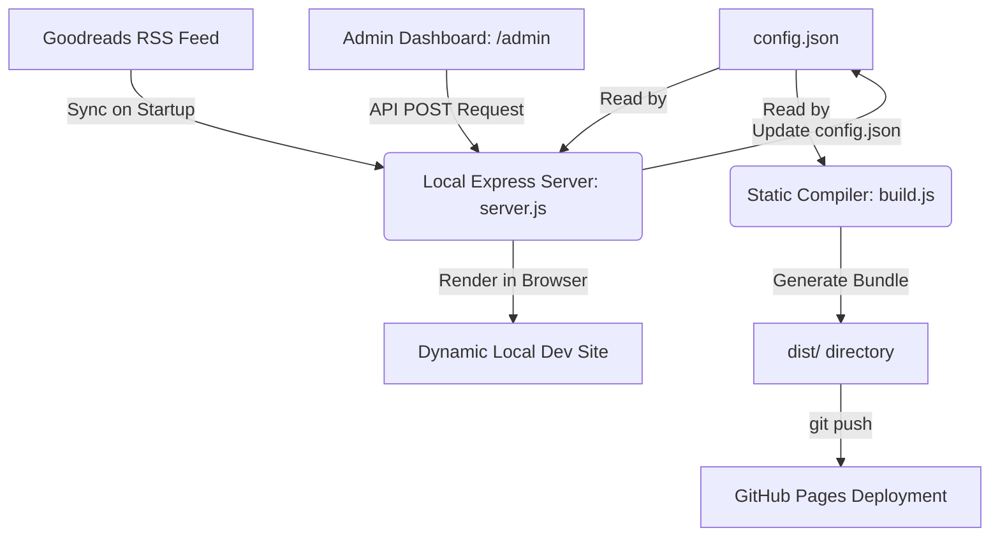

# 🏛️ Portfolio: Renaissance Edition — Technical Overview & Architecture

Welcome to the technical overview of your personal portfolio website. This document provides a detailed breakdown of your site's architecture, design philosophy, technical stack, integrations, and developer workflows.

---

## 🎨 Design Philosophy & Aesthetic
Your site features the **"Renaissance Edition"** aesthetic—a sleek, premium, high-end light theme blending classical, publication-grade layout structures with cutting-edge web-native technologies. 

* **Color System:** A curated HSL/Hex palette centered around deep inky blacks (`#111111`) and pure whites (`#ffffff`), avoiding generic colors to maintain a premium feel.
* **Typography:** Uses modern fonts loaded from Google Fonts:
  * **Oswald**: A bold, condensed sans-serif used to give major titles a commanding, industrial, and classical editorial feel.
  * **Inter**: A highly legible, clean geometric sans-serif for secondary subtext, experience rows, and reading details.
* **Special Visual Layers:** 
  * **WebGL Particle Network:** Powered by **Three.js** in a background canvas, rendering a floating, elegant node-and-connector network structure reacting subtly to mouse movement.
  * **Analog SVG Noise Overlay:** A highly subtle SVG noise texture applied over the viewport, adding a soft, textured paper/grain aesthetic to mitigate harsh digital gradients.
  * **Difference-Blending Custom Cursor:** A modern lag-free mouse cursor that uses CSS `mix-blend-mode: difference`, dynamically scaling and inverting colors on interactive elements.

---

## 🛠️ Technology Stack & Libraries
The application is built to be dynamic and easy to edit during local development, but is compiled down to a super-fast, 100% static site for free, scalable hosting.

### Frontend (Client-side)
* **Core**: Semantic HTML5 and Vanilla CSS3.
* **WebGL Rendering**: [Three.js (r128)](https://threejs.org/) for the animated background particles.
* **Smooth Inertial Scrolling**: [Lenis (v1.0.39) by Studio Freight](https://github.com/darkroomengineering/lenis) for silky smooth scroll feedback across all modern browsers.
* **Rich Scroll Animations**: [GSAP (GreenSock Animation Platform 3.12.2)](https://greensock.com/gsap/) and [ScrollTrigger](https://greensock.com/scrolltrigger/) power:
  * Word-by-word fade reveals (`.reveal-type`).
  * Staggered entrance animations for experience cards, technical pills, and project grids.
  * Elastic magnetic mouse-pull effects on call-to-actions.
  * **Center Focus Slide-Decks**: An advanced pinned presentation layout for showcasing work highlights.

### Backend (Local Development & CMS)
* **Runtime**: [Node.js](https://nodejs.org/) & [Express](https://expressjs.com/) (`server.js`).
* **Asset Uploads**: [Multer](https://github.com/expressjs/multer) for managing image uploads in the Admin panel.
* **Data Scraper**: [RSS-Parser](https://github.com/rbren/rss-parser) for extracting live bookshelf updates.

---

## 🏗️ System Architecture & Data-Flow
Your site operates on a **Data-Driven Templating Architecture**. Rather than hardcoding information inside your HTML, your data is decoupled entirely from your layout.



### The Source of Truth: `config.json`
Everything displayed on your site lives inside `config.json`. This includes:
* **Hero Text**: Headline rows and location subtext.
* **Manifesto**: Personal professional mission statements.
* **Skills Stack**: Programming languages and tools currently in focus.
* **Work Highlights**: Titled slides with dedicated Unsplash background images.
* **Steam Games**: Playtime statistics and library box art.
* **Goodreads Books**: Real-time reading logs.

---

## 🔌 Core API Integrations

### 1. Live Goodreads Sync (`lib/goodreads.js`)
Instead of needing manual updates when you finish a book, your server connects directly to your Goodreads public RSS Feed (`user ID: 194760406`).
* **Multi-Shelf Parsing**: Automatically scrapes shelves for `read`, `currently-reading`, and `to-read`.
* **Data Cleanup**: Extracts average star ratings, user ratings, date added, shelf flags, and custom cover images.
* **High-Resolution Fix**: Goodreads feed cover images are typically low-res thumbnails. The library uses regular expressions to clean up suffix modifiers (e.g. removing `._SY75_` and turning `m/` or `s/` paths into `l/`), serving high-resolution covers instead.
* **Smart UI Display**: Books rated $\ge 4.5$ stars are automatically highlighted with a **"TOP RATED"** gold border and badge on your portfolio. Shows the first 6 items by default, with a magnetic toggle button to expand the list.

### 2. Interactive CMS Dashboard (`/admin`)
An Express-based admin UI accessible locally at `/admin` allows visual content management.
* **Inputs & Textareas**: Edit your biography, text details, social handles, and CV download link visually.
* **Media Upload Manager**: Upload images directly. Drag or select files inside the UI to post them to the server. Express handles the file via Multer, saves it to `assets/` with a timestamp-prefixed filename, and returns the asset path to save back to `config.json`.

---

## 🚀 Development & Deployment Workflows

To run, compile, or deploy your portfolio, utilize the custom scripts pre-configured in your `package.json`.

### 1. Run Locally
To preview changes, write content, or sync Goodreads:
```bash
npm install
npm start
```
* Locates server at **`http://localhost:8000`**
* Locates admin console at **`http://localhost:8000/admin`**

### 2. Compile to Static Bundle
To parse your layout template (`index.html`) and inject the JSON data into a standalone web page:
```bash
npm run build
```
* **Process**: Compiles all template keys (like `{{HERO_LINE1}}` and `{{BOOKS_ITEMS}}`), writes the completed HTML to `dist/index.html`, copies over CSS and JS bundles, and duplicates everything in `assets/` to `dist/assets/`.

### 3. Deploy Live
To publish to the internet:
```bash
npm run deploy
```
* **Process**: Automates a static build and uses `gh-pages` to commit the isolated compiled `dist` directory straight to the `gh-pages` deployment branch on your GitHub repository.

---

## 💡 Recommended Enhancements
To take your portfolio to the next level, consider these incremental improvements:

1. **Automated Goodreads Sync via GitHub Actions**:
   * Instead of needing to run `npm start` locally to trigger a Goodreads RSS pull before deploying, you could set up a daily GitHub Action that pulls the RSS feed, commits the new `config.json` directly, builds the static folder, and publishes.
2. **Contact Form Endpoint**:
   * Currently, the "Connect" button opens a `mailto:` link. You could integrate a free form service like [Formspree](https://formspree.io/) or [Form Bold](https://formbold.com/) inside the HTML to let users send messages without leaving the page.
3. **Custom Domain**:
   * Add a `CNAME` file to your static compiler copies to bind the GitHub Pages deployment to your custom domain name (e.g., `sidharthparihar.com`).
